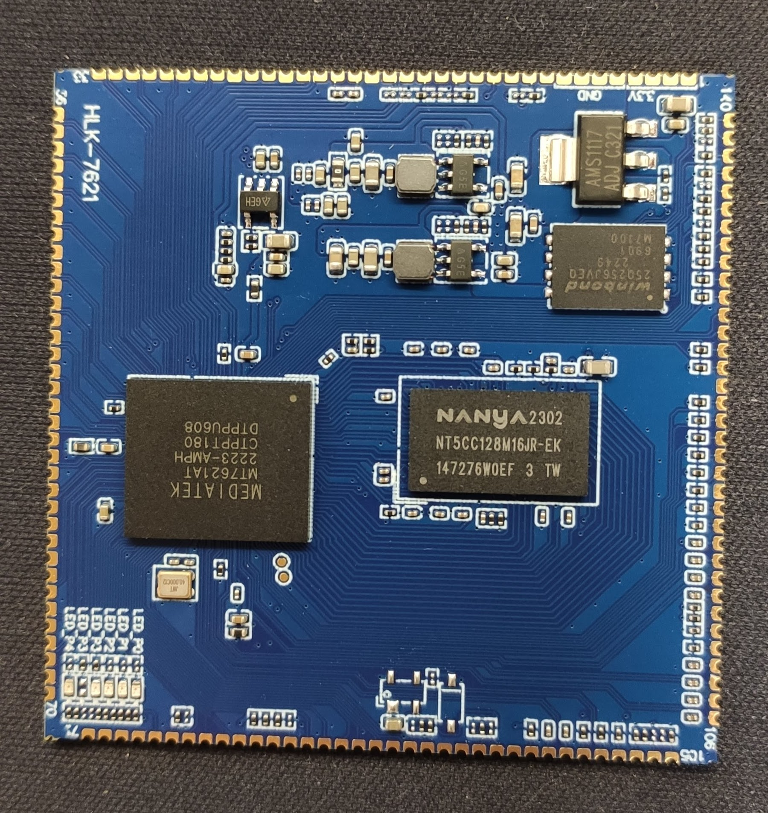
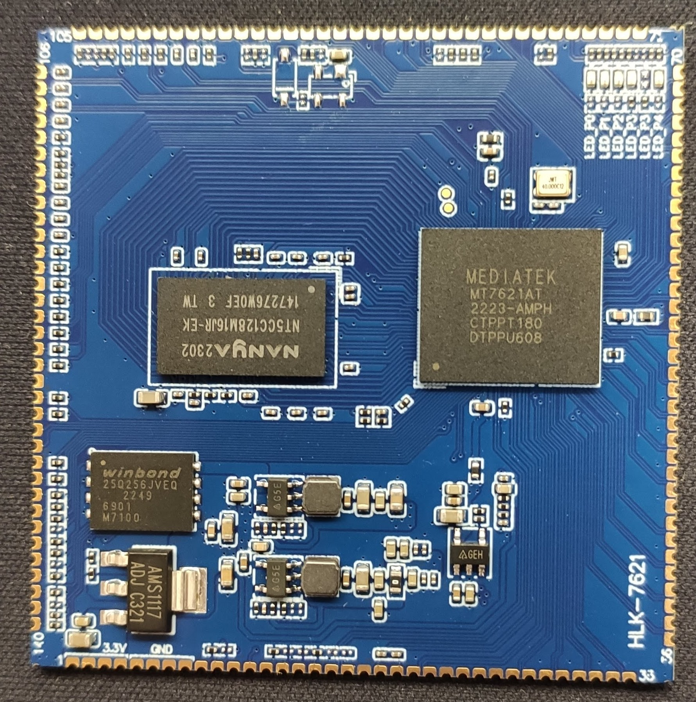
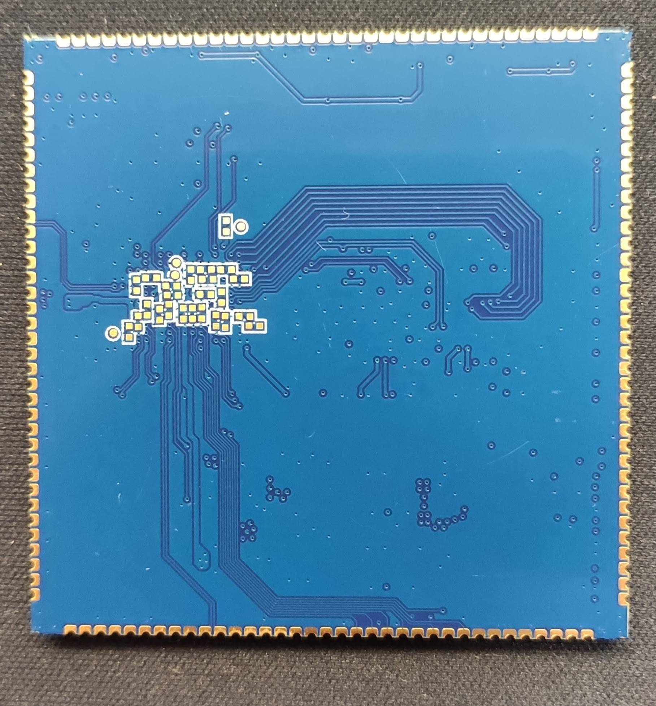

- HLK-7621A module Memory: DDR3(L) - 256MB, SPI Flash  - 32MB

- Operating Voltage: 3.3V

- Operating Current: ~500mA

~~~
Embedded MIPS1004Kc (880 MHz, Dual-Core)
	- 32 KB I-Cache and 32 KB D-Cache per core
	- 256 KB L2 Cache (shared by Dual-Core
	- SMP capable
	- Single processor operation configurable
Gigabit Switch
	- 5 ports with full-line rate
	- 5-port 10/100/1000Mbps MDI transceivers
One RGMII/MII interface
16-bit DDR2/3 up to 256/512 Mbytes
SPI(2 chip select), NAND Flash(SLC), SDXC,eMMC(4 bits)
USB3 x 1+ USB2 x 1 or USB2 x 2 (all host)
PCIe host x 3
I2C, UART Lite x 3, JTAG, MDC, MDIO, GPIO
VoIP support (I2S, PCM)
Audio interface (SPDIF-Tx, I2S, PCM)
Deliver the superb Samba performance via USB2.0/USB 3.0/SD-XC
HW storage accelerator
HW NAT
	- 2Gbps wired speed
	- L2 bridge
	- IPv4 routing, NAT, NAPT
	- IPv6 routing, DS-Lite, 6RD, 6to4
HW QoS
	- 16 hardware queues to guarantee the min/max bandwidth of each flow.
	- Seamlessly co-work with HW NAT engine.
	- 2Gbps wired speed.
HW Crypto
Deliver 400~500 Mbps IPSec throughput
~~~
