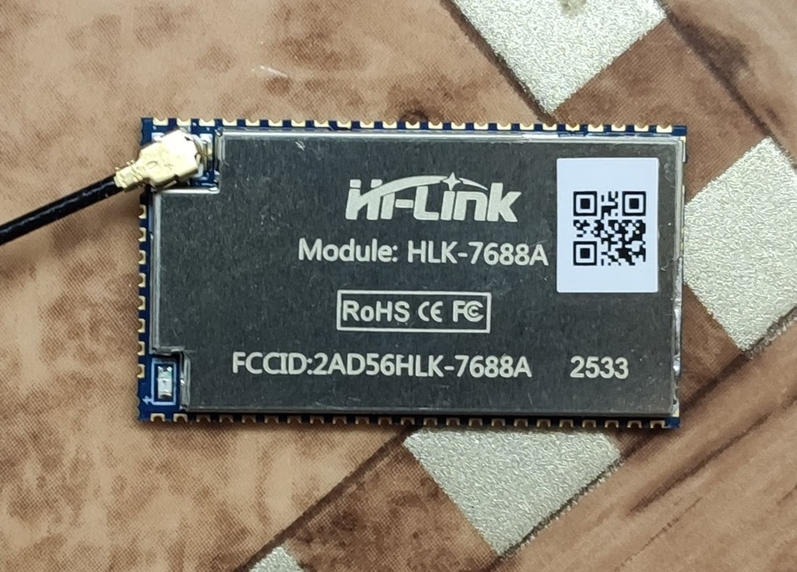

[HLK-7688A](https://www.hlktech.com/en/Product/Details/52#datum)

Product Introduction: 
 The 7688A is a module based on the MediaTek MT7688AN chip.
          580MHz MIPS 24KEc TM CPU
 It supports 2.4GHz 802.11b/g/n standards, with a maximum speed of 150Mbps.
 It supports 5 10/100Mbps Ethernet switch interfaces,
 Linux and OpenWrt operating systems, and allows for custom development.
 It can be widely used in home wireless routers, industrial control,
 smart homes, smart security, and various other embedded systems and IoT terminal devices.

Product Features:

- Powerful data processing capabilities, MCU clock speed up to 580MHz

- HLK-7688A module Memory: DDR2 - 128MB, SPI Flash  - 32MB

- Hardware Interfaces: UART, IIC, PWM, GPIO, SPI, i2s (SPI/SD-XC/eMMC)

- Operating Voltage: 3.3V

- GPIO Drive Capability: 4mA

- Operating Current: ~200mA

- Operating Temperature: -40c ~ +80c

- Compatible with IEEE 802.11 b/g/n, IEEE 802.3 & IEEE 802.3u

- Single-frequency 1T1R mode, data rate up to 150Mbps, Range: 2.412GHz-2.484GHz

- Supports multiple encryption methods: WEP64/128, TKIP, AES, WPA/WPA2, WAPI

- Supports QoS, WMM, WMM-PS

- Supports STA/AP/AP+STA working modes  (Support 16 Multiple BSSID)

- Five 10/100M auto-sensing ETH network ports

- Supports multiple operating systems: Linux 2.6.36 SDK, OpenWrt 14.07

- Network Protocol: IPv4, TCP/UDP

- Maximum Connections: 20~30 (TCP/UDP)

- Firmware Upgrade: Wireless Upgrade, Serial Port Upgrade, Ethernet Port Upgrade

Наш вариант, платка:

Припаял:

добавить себя в группу (для доступа к /dev/ttyUSB0)

root@fedora:~# usermod -a -G dialout user

перезайти в сесию

подключится, платка usb-uart к hlk-7688a (нулевой UART)

user@fedora:~# picocom -b 57600 /dev/ttyUSB0

припаял HR911105A к первой группе и обновил прошивку tftp через меню u-boot 

~~~
прошивка openwrt-24.10.4-ramips-mt76x8-hilink_hlk-7688a-squashfs-sysupgrade.bin
ложим в /var/lib/tftpboot
только переименовать в короткое имя надо
и запустить tftp
$ service tftp start
~~~

потом перепаял HR911105A на четвертую группу, не знаю, не пробовал, пошла ли бы прошивка с четвёртой группы...

надо подключать Ethernet HR911105A надо к четвертой группе, это соответствует мосту br-lan

который в зависимости от прошивки может иметь статический адрес 192.168.1.1

я перенастроил на DHCP Client (подключив к ноуту через Web интрфейс), пока мне так удобнее

и настроить постоянный MAC адрес для br-lan

припаял USB коннектор, вставляю флешку - видит... там ещё надо поставить пакеты для монтирования разных файловых систем...

~~~

root@OpenWrt:~# opkg find kmod-usb-serial*
root@OpenWrt:~# opkg install kmod-usb-serial-cp210x
root@OpenWrt:~# opkg install kmod-usb-serial-ch341 kmod-usb-serial-ftdi
root@OpenWrt:~# opkg install picocom
root@OpenWrt:~# picocom --echo -b 115200 /dev/ttyUSB0

~~~

[hwinfo](openwrt/hwinfo.md)

# PS:

есть [цикл статей](https://radiohlam.ru/tag/omega2/) про другой модуль , но на том-же MT7688

[Микрокомпьютер Omega2. Часть 1. Первое знакомство.](https://radiohlam.ru/omega2_1/#more-2867)

[Микрокомпьютер Omega2. Часть 2. Использование GPIO.](https://radiohlam.ru/omega2_2/#more-2972)

[Микрокомпьютер Omega2. Часть 3. Док-плата](https://radiohlam.ru/omega2_3/#more-2994)

[Микрокомпьютер Omega2. Часть 4. Работа с файлами (Midnight Commander, SCP, FTP).](https://radiohlam.ru/omega2_4/#more-3002)

[Микрокомпьютер Omega2. Часть 5. Работа с USB flash-дисками](https://radiohlam.ru/omega2_5/#more-3014)

[Микрокомпьютер Omega2. Часть 6. Установка, настройка и использование php для интерактивного взаимодействия](https://radiohlam.ru/omega2_6/#more-3023)

[Микрокомпьютер Omega2. Часть 7. Выполнение задач по расписанию с помощью планировщика Cron](https://radiohlam.ru/omega2_7/#more-3073)

[Микрокомпьютер Omega2. Часть 8. Подключаем проводной Ethernet](https://radiohlam.ru/omega2_8/#more-3107)

[Микрокомпьютер Omega2. Часть 9. Сборка альтернативной прошивки на базе OpenWRT](https://radiohlam.ru/omega2_9/#more-3149)

[Переключение «налету» между LAN-портами и SD-картой в микрокомпьютерах на базе SOC MT7688AN](https://radiohlam.ru/mt7688_lan/#more-4908)

# PS2:

[Hi-Link HLK-7688A [OpenWrt] – обсуждение](https://4pda.to/forum/index.php?showtopic=966932)
                                                         
[Модернизированные загрузчики UBOOT для маршрутизаторов](https://4pda.to/forum/index.php?showtopic=678446)

