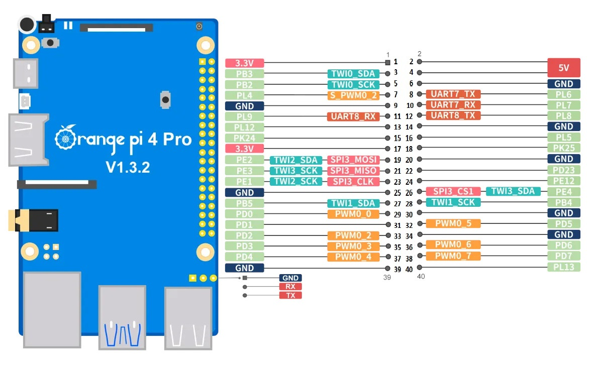

[orange pi 4 pro](http://www.orangepi.org/html/hardWare/computerAndMicrocontrollers/details/Orange-Pi-4-Pro.html)

[4pda - orange pi 4 pro](https://4pda.to/forum/index.php?showtopic=1117134)

~~~
SOC:
	Allwinner A733

CPU:
	2× Cortex-A76 + 6× Cortex-A55
	Макс. частота: 2.0 GHz

GPU:
	Imagination BXM-4-64

NPU:
	Производительность: 3 TOPS @ INT8
	INT8 / INT16 / FP16 / BF16

MCU:
	RISC-V E902 Co-processor (200 MHz)

PMIC:
	AXP318

Memory:
	До 16 GB LPDDR5

Storage:
	eMMC (опц.): 16 / 32 / 64 / 128 GB
	UFS (альтернатива eMMC)
	SPI Flash: 128 Mb или 256 Mb
	M.2 M-Key (PCIe 3.0, NVMe SSD)
	TF-card до 128 GB

Wi-Fi + Bluetooth:
	Wi-Fi 6
	Bluetooth 5.4
	BLE

Ethernet:
	Gigabit Ethernet
	PHY: YT8531CA
	PoE

Display:
	HDMI 2.0 (4K@60)
	MIPI DSI, 4-lane

Camera:
	MIPI CSI 2-lane
	MIPI CSI 4-lane

USB:
	USB 3.0 Host ×1
	USB 2.0 Host ×3

Audio:
	3.5 мм jack (in/out)
	Speaker ×1
	Mic ×1

Buttons:
	BOOT
	Reset
	Power

RTC:
	2-pin battery + and - solder joints

40-PIN:
	GPIO
	UART
	I²C
	SPI
	PWM

Power supply:
	USB Type-C
	5V / 3A

Dimensions:
	89 × 56 мм

Weight:
	58 г
~~~

