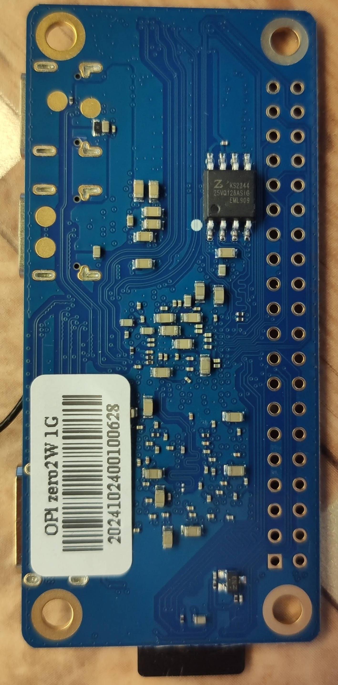
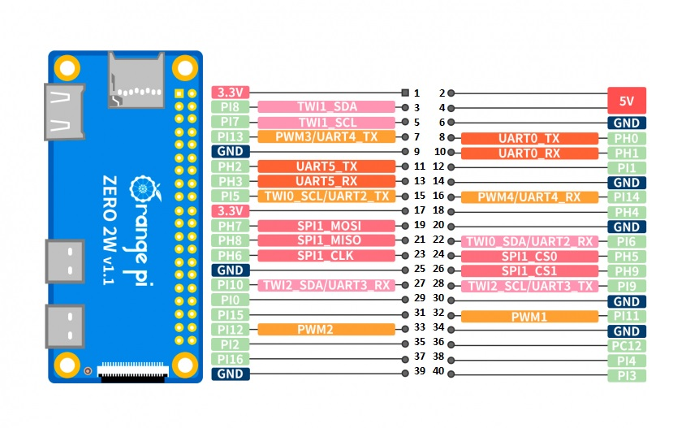

заказал на OZON 

Orange Pi Zero 2W WiFi Bluetooth SBC одноплатный компьютер

[Orange Pi Zero 2W](http://www.orangepi.org/html/hardWare/computerAndMicrocontrollers/details/Orange-Pi-Zero-2W.html)

[download](http://www.orangepi.org/html/hardWare/computerAndMicrocontrollers/service-and-support/Orange-Pi-Zero-2W.html)
~~~
		Hardware Parameters
CPU	Allwinner H618 Quad-Core Cortex-A53 Processor 1.5GHz
GPU	Mali G31 MP2
	- Support OpenGL ES 1.0/2.0/3.2, OpenCL 2.0, Vulkan 1.1
RAM	LPDDR4:1GB/1.5GB/2GB/4GB (optional)
Memory	SPI Flash: 16MB
Wi-Fi + BT	Wi-Fi5.0+BT 5.0
Video output	1*Mini HDMI TX 2.0 port supporting 4K@60FPS
USB	Type-C USB2.0*2
SD card interface	1*Micro SD card interface
Expansion interface	24Pin expansion interface: USB2.0*2, 100M Ethernet interface, IR receiver interface, audio output, TV-out, power button, user-defined buttons*2
40Pin	40Pin function expansion interface, supporting the following interface types:
	GPIO、UART、I2C、SPI、PWM
Power Source	Type-C 5V2A，Type-C 5V3A
Supported OS	Android 12 TV，Debian11，Debian12，Ubuntu22.04，Ubuntu20.04，Orange Pi OS（Arch）
PCB Dimension	30mm x 65mm x 1.2mm
Weight	12.5g
~~~

пришло в фирменной картонной коробочке, антена и Гребёнка - в комплекте.

мини hdmi кабель, type-c хабик, флешка и радиаторы, всё это Я подготовил заранее.

поставил debian с оф. сайта orange pi.  -  kernel 6.1.31

проблема wifi5 решение

~~~
# sudo apt install firmware-realtek
~~~

***********************************

открыть порт uart5

(1) в утилите orangepi-config

    открываем ph-uart5  

#    ph - это значит на контактах  PH2(tx) и PH3(rx) 

    перезагрузка

(2) теперь можно пользоватся , например так
~~~
$ picocom -echo -b 115200 /dev/ttyS5
~~~

***********************************

