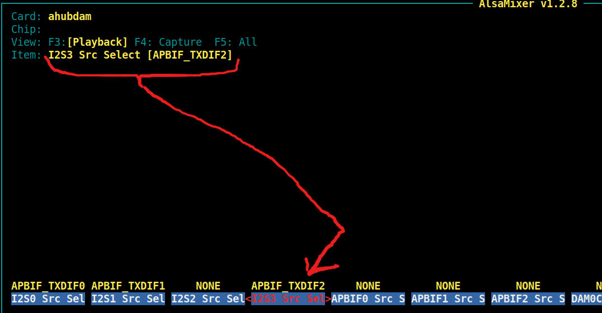

Orange Pi Zero 2W WiFi Bluetooth SBC одноплатный компьютер

Задача, вывести i2s на гребенку (40 пиновый разьем)

подключить внешний DAC 

*******************************************

как я понял, тут три выхода i2s
~~~

Audio HUB
* One Audio HUB
* Supports 2 Digital Audio MIXER(DAM)
* Supports 3 I2S/PCM interfaces for connecting external devices, and 1 I2S/PCM for connecting internal HDMI
* Supports Left-justified, Right-justified, Standard I2S mode, PCM mode, and TDM mode
* I2S mode supports 8 channels, and 32-bit/192 kbit sample rate
* I2S and TDM modes support maximum 16 channels, and 32-bit/96 kbit sample rate

i2s0 - не удалось включить, не совсем понял, что это
i2s1 ? подключен к HDMI ?
i2s2 подключён к внешнему Bluetoon(+wifi) адаптеру на плате
i2s3 - можно использоватьчерез контакты

      40 pin connector
H_I2S3_MCLK   -> PH5 -> 24 
H_I2S3_BCLK   -> PH6 -> 23
H_I2S3_LRCK   -> PH7 -> 19
H_I2S3_DOUT0  -> PH8 -> 21
H_I2S3_DIN0   -> PH9 -> 26

~~~

1) включаем i2s3

из проекта [Opi_Zero_3_I2S3_6.1](https://github.com/elkoni/Opi_Zero_3_I2S3_6.1)

берем файл sun50i-h616-i2s3_v3.dts

добовляем, комманда:

~~~
# orangepi-add-overlay sun50i-h616-i2s3_v2.dts
~~~

в файле 

/boot/orangepiEnv.txt

должна появится строчка

user_overlays=sun50i-h616-i2s3_v3

далее

$ alsamixer

настроить вход миксера как на картинке

тест
~~~
посмотреть в alsamixer (F6)
на какой № позиции будет в списке карт
 типа:
  default:3  ahubi2s3
 или
  default:1  ahubi2s3

$ aplay -D hw:3,0 /usr/share/sounds/alsa/audio.wav
или
$ aplay -D hw:1,0 /usr/share/sounds/alsa/audio.wav
~~~

2) устанавливаем mpd и mpc

# apt install mpd mpc

mpd включаем в автозагрузку

и в его файлике настроек /etc/mpd.conf прописываем audio выход

вида
~~~
audio_output {
	type		"alsa"
	name		"My ALSA Device"
	device		"hw:1,0"	# optional
	mixer_type	"software"	# optional

~~~

загружаем playlist

допустим это файл Radio.m3u

ложим его в директорию /var/lib/mpd/playlists

грузим

$ mpc load Radio

играем 1 станцию

$ mpc play 1 

чтоб станция не перескакивала на следующую, надо включить

$ mpc repeat on

$ mpc single on

****************************************

