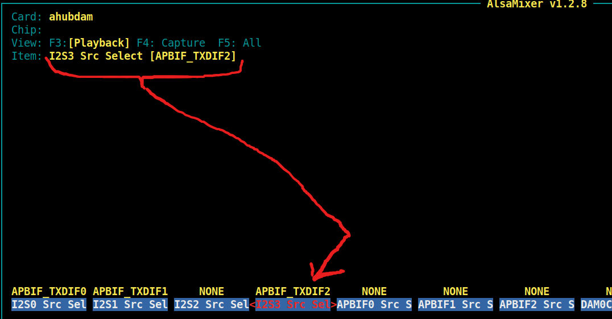

Orange Pi Zero 2W WiFi Bluetooth SBC одноплатный компьютер

Задача, вывести i2s на гребенку (40 пиновый разьем)

подключить внешний DAC 

*******************************************

как я понял, тут три выхода i2s
~~~

Audio HUB
* One Audio HUB
* Supports 2 Digital Audio MIXER(DAM)
* Supports 3 I2S/PCM interfaces for connecting external devices, and 1 I2S/PCM for connecting internal HDMI
* Supports Left-justified, Right-justified, Standard I2S mode, PCM mode, and TDM mode
* I2S mode supports 8 channels, and 32-bit/192 kbit sample rate
* I2S and TDM modes support maximum 16 channels, and 32-bit/96 kbit sample rate

i2s0 - не удалось включить, не совсем понял, что это (PI0,PI1,PI2,PI3,PI4)
      40 pin connector
H_I2S0_MCLK   -> PI0 -> 29 
H_I2S0_BCLK   -> PI1 -> 12
H_I2S0_LRCK   -> PI2 -> 35
H_I2S0_DOUT0  -> PI3 -> 40
H_I2S0_DIN0   -> PI4 -> 38

i2s1 ? подключен к HDMI ?
i2s2 подключён к внешнему Bluetoon(+wifi) адаптеру на плате

i2s3 - можно использоватьчерез контакты (PH5,PH6,PH7,PH8,PH9)
      40 pin connector
H_I2S3_MCLK   -> PH5 -> 24 
H_I2S3_BCLK   -> PH6 -> 23
H_I2S3_LRCK   -> PH7 -> 19
H_I2S3_DOUT0  -> PH8 -> 21
H_I2S3_DIN0   -> PH9 -> 26

например 
  (PCM5102a)
|I2S DAC    | 40 pin connector Orange Pi Zero 2w
-------------------------------------------------
|FSCLK(LRCK) - 19
|DATA (DIN)  - 21
|BCLK (BCK)  - 23
|gnd         - 25(gnd)
|5V          - 2 (5V)
-------------------------------------------------
~~~

1) включаем i2s3

из проекта [Opi_Zero_3_I2S3_6.1](https://github.com/elkoni/Opi_Zero_3_I2S3_6.1)

[или отсюда](device/Opi_Zero_3_I2S3_6.1)

берем файл sun50i-h616-i2s3_v2.dts

добавляем, комманда:

~~~
     для i2s3
# orangepi-add-overlay sun50i-h616-i2s3_v2.dts

 или для i2s0
# orangepi-add-overlay sun50i-h616-i2s0_v4.dts
~~~

в файле 

/boot/orangepiEnv.txt

должна появится строчка

user_overlays=sun50i-h616-i2s3_v2

перезагружаемся
~~~
    для i2s3
root@orangepizero2w:~# cat /sys/kernel/debug/pinctrl/300b000.pinctrl/pinmux-pins | grep -E "i2s"
  должно быть что то такое
pin 229 (PH5): device soc:ahub3_plat function i2s3 group PH5
pin 230 (PH6): device soc:ahub3_plat function i2s3 group PH6
pin 231 (PH7): device soc:ahub3_plat function i2s3 group PH7
pin 232 (PH8): device soc:ahub3_plat function i2s3_dout0 group PH8

 или для i2s0
root@orangepizero2w:~# cat /sys/kernel/debug/pinctrl/300b000.pinctrl/pinmux-pins | grep -E "i2s"
pin 256 (PI0): device soc:ahub0_plat function i2s0 group PI0
pin 257 (PI1): device soc:ahub0_plat function i2s0 group PI1
pin 258 (PI2): device soc:ahub0_plat function i2s0 group PI2
pin 259 (PI3): device soc:ahub0_plat function i2s0_dout0 group PI3
pin 260 (PI4): device soc:ahub0_plat function i2s0_din0 group PI4
~~~

далее

$ alsamixer

настроить вход миксера как на картинке

тест
~~~
посмотреть в alsamixer (F6)
на какой № позиции будет в списке карт
 типа:
  default:3  ahubi2s3
 или
  default:1  ahubi2s3

$ aplay -D hw:3,0 /usr/share/sounds/alsa/audio.wav
или
$ aplay -D hw:1,0 /usr/share/sounds/alsa/audio.wav
~~~

2) устанавливаем mpd и mpc

# apt install mpd mpc

mpd включаем в автозагрузку

и в его файлике настроек /etc/mpd.conf прописываем audio выход

вида (device указываем тот который определили)
~~~
audio_output {
	type		"alsa"
	name		"My ALSA Device"
	device		"hw:1,0"	# optional
	mixer_type	"software"	# optional

если звук "заторможен" то добавить (это даже сработало для 32 битной карты, драйвер наверно?)
    format        "44100:16:2"      # <--- РЕШЕНИЕ: Явно задаем частоту 44.1 кГц, 16 бит, стерео
    auto_resample "no"              # Отключаем авто-передискретизацию
    auto_format   "no"              # Отключаем авто-подбор формата

проверить параметры
cat /proc/asound/ahubi2s3/pcm0p/sub0/hw_params
~~~

загружаем playlist

допустим это файл Radio.m3u

ложим его в директорию /var/lib/mpd/playlists

грузим

$ mpc load Radio

играем 1 станцию

$ mpc play 1 

чтоб станция не перескакивала на следующую, надо включить (иногда паузы в вещании через интернет есть)

$ mpc repeat on

$ mpc single on

****************************************

