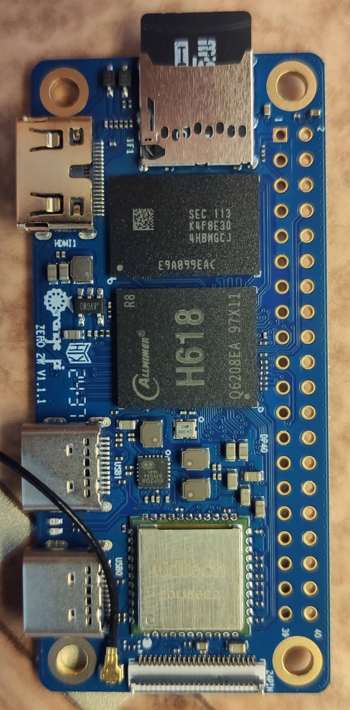

# test_soc

что то поделать на отладках SoC (система-на-чипе)

(Делал для себя, Заметки для того чтобы не забыть, и не потерять (что может быть лучьше git))

***********************************************************************************************

# MilkV-Duo

***********************************************************************************************

# OrangePiZero2w

***********************************************************************************************

# HLK-7688A

***********************************************************************************************
