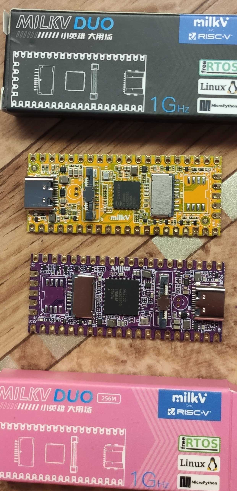
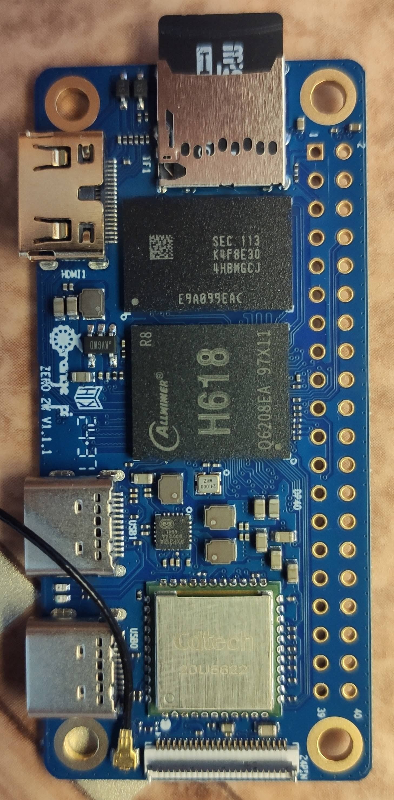
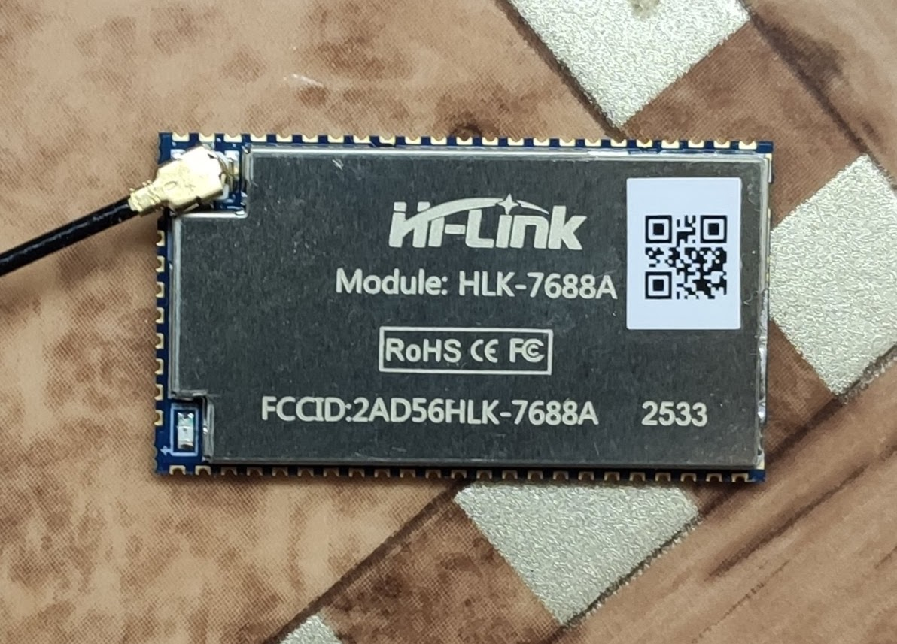
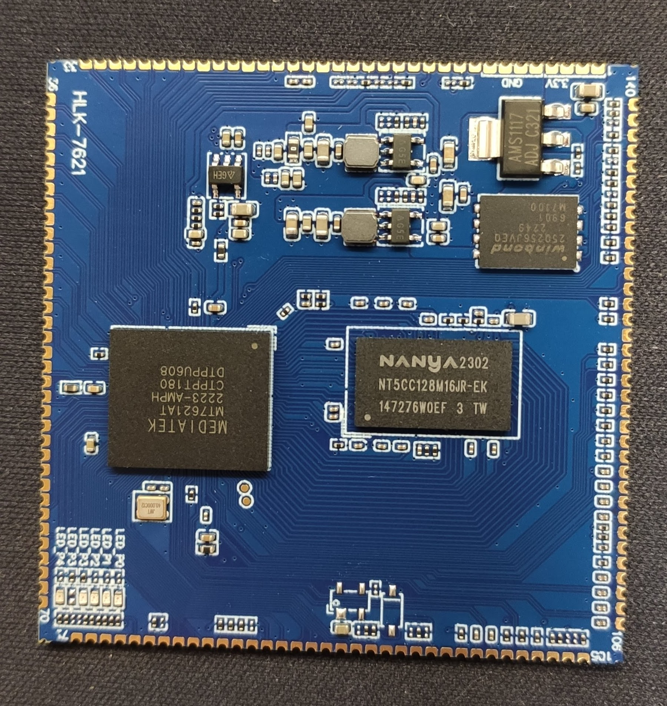

# test_soc

что то поделать на отладках SoC (система-на-чипе)

(Делал для себя, Заметки для того чтобы не забыть, и не потерять (что может быть лучьше git))

***********************************************************************************************

# [MilkV-Duo](MilkV-Duo/README.md)

***********************************************************************************************

# [OrangePiZero2w](OrangePiZero2w/README.md)

***********************************************************************************************

# [HLK-7688A](HLK-7688A/README.md)

***********************************************************************************************

# [HLK-7621A](HLK-7621A/README.md)

***********************************************************************************************
